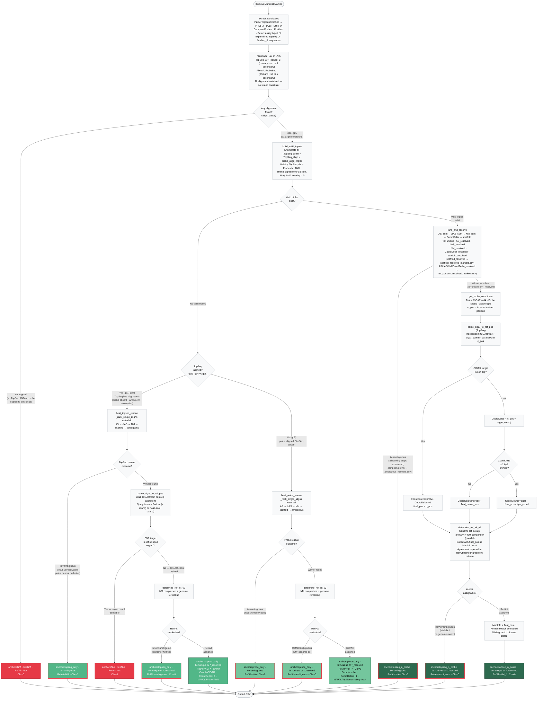

# Array Manifest Remapper

A computational pipeline for remapping Illumina genotyping array manifests between reference genome assemblies. Uses a **dual-alignment strategy** — aligning both the short physical probe (50 bp) and the longer `TopGenomicSeq` context sequence — to ensure high-fidelity coordinate conversion, correct strand assignment, and precise Ref/Alt allele determination consistent with VCF standards.

Originally developed to remap the **Equine80select** array from EquCab2 to EquCab3.

---

## Prerequisites

- **Conda** or **Mamba** package manager
- **Reference genome FASTA** indexed with `samtools faidx`

## Setup

```bash
git clone git@github.com:drtamermansour/Equine80select_remapper.git
cd Equine80select_remapper
bash install.sh
conda activate remap
```

---

## Pre-pipeline: Scaffold Haplotype Exclusion (Optional)

Modern genome assemblies include unplaced scaffolds that are often alternative haplotypes of placed chromosomes. Including them in the reference causes ambiguous multi-mapping, reducing remapping confidence. Three scripts handle scaffold characterisation and exclusion **before** running the main pipeline.

### Step 1 — Characterise scaffolds

```bash
python scripts/scaffold_haplotype_analyzer.py \
    -r equCab3/equCab3_genome.fa \
    -o scaffold_haplotype_analysis/ \
    --threads 8
```

Aligns all unplaced scaffolds to the placed chromosomes using `minimap2 -x asm5` and produces `scaffold_summary.tsv` with per-scaffold alignment statistics (`identity_pct`, `query_coverage_pct`, `span_to_scaffold_ratio`, `max_mapq`, `n_alignment_blocks`).

### Step 2 — Filter to alt-haplotype candidates

```bash
python scripts/filter_scaffold_haplotypes.py \
    -i scaffold_haplotype_analysis/scaffold_summary.tsv \
    -o scaffold_haplotype_analysis/alt_haplotype_candidates.tsv
```

Applies threshold filters to select scaffolds likely to be alternative haplotypes. Default thresholds are Tier 1 (high confidence). See **[docs/scaffold_haplotype_thresholds.md](docs/scaffold_haplotype_thresholds.md)** for the full threshold rationale and multiple strictness tiers.

Key CLI flags:

| Flag | Default | Meaning |
|---|---|---|
| `--min-identity` | 99.0 | Minimum `identity_pct` |
| `--min-query-cov` | 80.0 | Minimum `query_coverage_pct` |
| `--max-span-ratio` | 1.5 | Maximum `span_to_scaffold_ratio` |
| `--min-mapq` | 40 | Minimum `max_mapq` |
| `--max-blocks` | 5 | Maximum `n_alignment_blocks` |

### Step 3 — Build cleaned reference

```bash
python scripts/exclude_alt_haplotypes.py \
    --scaffolds scaffold_haplotype_analysis/alt_haplotype_candidates.tsv \
    --reference equCab3/equCab3_genome.fa \
    --output-dir equCab3_cleaned/
```

Removes the identified scaffolds from the FASTA and writes an indexed cleaned reference. Outputs:

| File | Description |
|---|---|
| `{stem}_no_alt_haplotypes.fa` | Cleaned FASTA with alt-haplotype scaffolds removed |
| `{stem}_no_alt_haplotypes.fa.fai` | samtools index |
| `exclusion_report.txt` | Count of excluded / retained sequences; lists any scaffold IDs not found in reference |

Use the cleaned FASTA as the `-r` input to the main pipeline.

---

## Running the Pipeline

```bash
bash run_pipeline.sh \
    -i backup_original/Equine80select_24_20067593_B1.csv \
    -r equCab3/equCab3_genome.fa \
    -a equCab3 \
    -o results/
```

The pipeline script is a wrapper for 3 steps:
* Step 1: Index reference if needed 
* Step 2: Core remapping (`remap_manifest.py`) 
* Step 3: QC filtering and output generation (`qc_filter.py`) 


### All Options

#### General

| Flag | Default | Description |
|---|---|---|
| `-i / --manifest` | *(required)* | Path to the Illumina manifest CSV |
| `-r / --reference` | *(required)* | Path to the target reference genome FASTA |
| `-a / --assembly` | derived from FASTA filename | Assembly name used to label outputs |
| `-o / --output-dir` | `./output` | Output directory |
| `--keep-temp` | off | Retain intermediate FASTA/SAM files after `remap_manifest.py` completes |
| `--resume` | off | Skip step 2 (`remap_manifest.py`) if the remapped CSV already exists |

#### Remapping options (forwarded to `remap_manifest.py`)

| Flag | Default | Description |
|---|---|---|
| `-t / --threads` | `4` | Threads for minimap2 |

#### QC filter options (forwarded to `qc_filter.py`)

| Flag | Default | Description |
|---|---|---|
| `--mapq-topseq` | `30` | Minimum MAPQ for TopGenomicSeq alignments; `0` disables the filter and allows `probe_only` markers to pass |
| `--mapq-probe` | `0` (disabled) | Minimum MAPQ for probe alignments; `0` disables the filter and allows `topseq_only` markers to pass |
| `--coord-delta` | `-1` (disabled) | Remove markers where `\|probe_coord − CIGAR_coord\| > N` and all `topseq_only` markers |
| `--exclude-indels` | off | Remove all indel markers from outputs (VCF, BIM, map file) |
| `--require-strand-agreement` | off | Remove markers where probe strand disagrees with expected orientation |

For HPC clusters:

```bash
bash submit_slurm.sh -i <manifest.csv> -r <reference.fa> -a <assembly> -o results/ -t 64
```

---

## Outputs

Outputs are organised into two subdirectories inside `--output-dir`:

```
output-dir/
├── temp/                                        ← intermediate FASTA/SAM files (removed after pipeline)
├── remapping/                                   ← remap_manifest.py outputs
│   ├── {prefix}_remapped_{assembly}.csv         Full remapped manifest — coordinates + quality columns
│   ├── remapping_Report.txt                     Alignment, pair-filtering, and position-resolution summary
│   └── ambiguous_markers.csv                    Markers with ambiguous mapping (Chr=0)
└── qc/                                          ← qc_filter.py outputs
    ├── matchingSNPs_binary_consistantMapping.{assembly}_map   Main output (final marker map)
    ├── {prefix}_remapped_{assembly}.bim          PLINK BIM format (CHR, SNP, 0, POS, REF, ALT)
    ├── _matchingSNPs_binary_consistantMapping.vcf Final filtered VCF
    ├── _matchingSNPs.vcf                         VCF after design-conflict filter
    ├── _matchingSNPs_binary.vcf                  VCF after polymorphic-site filter
    ├── QC_Report.txt                             Marker counts at each QC filter stage
    └── remap_assessment/                         MAPQ histograms and known-assembly benchmarks
```

### Remapped CSV Columns

The remapped CSV adds **21 new columns** to every manifest row. All column names that embed the assembly name use the string passed via `-a` (e.g. `-a equCab3` → `Chr_equCab3`).

#### a. Coordinate and position columns

| Column | Type | Meaning |
|---|---|---|
| `Chr_{assembly}` | str | Chromosome (`"0"` = unmapped or ambiguous) |
| `MapInfo_{assembly}` | int | **Final chosen 1-based position** — probe-derived if `CoordDelta < 2`, CIGAR-derived if `CoordDelta ≥ 2` or indel |
| `Strand_{assembly}` | str | `+`, `−`, or `N/A` — TopGenomicSeq alignment strand |
| `Ref_{assembly}` | str | Reference allele in the **TopGenomicSeq alignment orientation**. `qc_filter.py` normalises `Ref` allele to the + strand later for VCF/BIM output. |
| `Alt_{assembly}` | str | Alternate allele in the TopGenomicSeq alignment orientation (same convention as `Ref`) |
| `CoordProbe_{assembly}` | int | Raw probe-derived coordinate before any CIGAR override; `0` for `topseq_only` and unmapped; populated for `probe_only` |
| `Coord_TopSeqCIGAR_{assembly}` | int | CIGAR-walk coordinate from TopGenomicSeq alignment; `0` if SNP in soft clip, `probe_only`, or unmapped |
| `CoordDelta_{assembly}` | float | `\|CoordProbe − Coord_TopSeqCIGAR\|`; `−1` if CIGAR coord unavailable (SNP in soft clip, `topseq_only`, or `probe_only`) |
| `CoordSource_{assembly}` | str | `"probe"` or `"cigar"` — which coordinate is in `MapInfo`; `"N/A"` for unmapped/ambiguous |
| `RefBaseMatch_{assembly}` | str | `"True"` / `"False"` / `"N/A"` — does the genome reference base at `MapInfo` match `Ref` after normalising `Ref` to the + strand? Computed in `remap_manifest.py` as a diagnostic; `qc_filter.py` repeats strand normalisation independently for its design-conflict filter. |
| `ProbeStrand_{assembly}` | str | Alignment strand of the probe: `+`, `−`, or `N/A`. `N/A` for `topseq_only` and unmapped. |
| `StrandAgreementAsExpected_{assembly}` | str | Whether the probe's alignment strand matches the orientation expected from `IlmnStrand`: `"True"`, `"False"`, or `"N/A"`. Always `"True"` or `"N/A"` for `topseq_n_probe` markers (strand disagreement is a hard filter in valid-triple construction). `"N/A"` for rescue paths and unmapped. Used by `qc_filter.py --require-strand-agreement`. |


#### b. Alignment quality columns

| Column | Type | Meaning |
|---|---|---|
| `MAPQ_TopGenomicSeq` | int | MAPQ of winning TopSeq alignment; `NaN` for `probe_only` markers (no TopSeq alignment) |
| `MAPQ_Probe` | int | MAPQ of winning probe alignment; `NaN` for `topseq_only` markers (no probe alignment) |
| `DeltaScore_TopGenomicSeq` | int | AS gap between 1st and 2nd-best TopSeq alignments; `−1` if fewer than 2 alignments |
| `QueryCov_TopGenomicSeq` | float | Fraction of TopSeq query in M/=/X aligned ops (excludes soft/hard clips); `0.0` for unmapped |
| `SoftClipFrac_TopGenomicSeq` | float | Fraction of TopSeq query that is soft-clipped; `0.0` for unmapped |

#### c. Decision columns (see Algorithm Details)

| Column | Values |
|---|---|
| `AlignmentStatus_{assembly}` | `gp1` (both TopSeq alleles + probe), `gp2` (one TopSeq + probe), `gp3` (both TopSeq, no probe), `gp4` (one TopSeq, no probe), `gp5` (probe only, no TopSeq), `unmapped` (nothing aligned). Computed before any filtering. |
| `anchor_{assembly}` | Which source(s) determined the final coordinate: `topseq_n_probe`, `topseq_only`, `probe_only`, `N/A` (see Confidence Tier Summary below) |
| `tie_{assembly}` | How a multi-locus tie was resolved: `unique`, `AS_resolved`, `dAS_resolved`, `NM_resolved`, `CoordDelta_resolved`, `scaffold_resolved`, `ambiguous`, `N/A` |
| `RefAltMethodAgreement_{assembly}` | Agreement between genome ref lookup and NM-based Ref/Alt (see values below) |


### Map File Format

`matchingSNPs_binary_consistantMapping.{assembly}_map` — tab-delimited, no header:

| Column | Description |
|---|---|
| chr | Chromosome |
| pos | Base-pair position |
| snpID | Marker name |
| SNP_alleles | Manifest alleles (e.g. `A,G`) |
| genomic_alleles | + strand alleles matching SNP_alleles order |
| SNP_ref_allele | The SNP allele corresponding to the reference |
| genomic_ref_allele | The reference allele on the + strand |
| decision | `as_is` or `complement` |

---

## Remapping Decision Tree

The diagram below shows the full per-marker decision flow in `scripts/remap_manifest.py`.



---

## Algorithm Details

### Infinium Chemistry

- **Infinium I**: two probes (AlleleA_ProbeSeq and AlleleB_ProbeSeq), both ending at the SNP. Variant = **last base** of probe.
- **Infinium II**: `AlleleB_ProbeSeq` is NaN. Variant = base immediately **after** probe 3′ end.
- On the minus strand, the probe's physical 3′ end maps to the alignment **start** position.
- **TopGenomicSeq**: The genomic sequence surrounding the variant position. It may contain insertions of IUPAC ambiguity characters compared to `SourceSeq` to better match the reference genome.


### Dual-Alignment Strategy

For each marker, two sequences are aligned to the reference with `minimap2 -ax sr -N 5` (both primary and up to 5 secondary alignments retained):

1. **TopGenomicSeq** — the genomic context `PREFIX[AlleleA/AlleleB]SUFFIX` is split into two candidates (one per allele). The candidate with lower NM at the winning locus is the reference allele.
2. **Probe** (`AlleleA_ProbeSeq`, 50 bp) — aligned independently. Must map to the same chromosome and overlap the TopSeq alignment window; no strand constraint imposed.

A **valid triple** is a `(TopSeq_allele × TopSeq_align × probe_align)` combination that satisfies:
- TopSeq chr == Probe chr
- Strand agreement check (`compute_probe_strand_agreement`) returns `"True"` or `"N/A"`
- Probe–TopSeq overlap > 0 bp


### Rescue Paths (no valid triple)

When no valid triple exists, the rescue strategy depends on whether TopSeq aligned:

**TopSeq-only rescue** (`best_topseq_rescue`, gp1–gp4): TopSeq aligned but no valid triple (probe absent, wrong chromosome, or no overlap). Uses AS → ΔAS → NM → scaffold ranking on TopSeq alignments. Outcomes: (a) tie=ambiguous → `anchor=topseq_only, tie=ambiguous, Chr=0`; (b) soft-clip → `anchor=N/A, unmapped, Chr=0`; (c) winner + Ref/Alt assigned → `anchor=topseq_only, tie=ts_tie, RefAlt=NM_*, Chr≠0`; (d) winner + Ref/Alt ambiguous → `anchor=topseq_only, tie=ts_tie, RefAlt=ambiguous, Chr=0`. TopSeq ambiguous and failures do **not** trigger probe rescue.

**Probe-only rescue** (`best_probe_rescue`, gp5 only): probe aligned, TopSeq produced no alignments. Uses the same AS → ΔAS → NM → scaffold ranking on probe alignments. No strand filtering (expected strand cannot be determined without a TopSeq anchor). Outcomes: (a) tie=ambiguous → `anchor=probe_only, tie=ambiguous, Chr=0`; (b) winner + Ref/Alt assigned → `anchor=probe_only, tie=pb_tie, RefAlt=NM_*, Chr≠0`; (c) winner + Ref/Alt ambiguous → `anchor=probe_only, tie=pb_tie, RefAlt=ambiguous, Chr=0`.


### Coordinate Selection Rule

**`anchor_{assembly}` values:**

| Value | Coordinate evidence |
|---|---|
| `topseq_n_probe` | Probe + TopSeq overlap confirmed; CIGAR cross-check applied (98.7% empirical accuracy) |
| `topseq_only` | No valid triple; TopSeq CIGAR walk used (`CoordSource=cigar`, `MAPQ_Probe=NaN`, `CoordDelta=−1`) (72.9% empirical accuracy) |
| `probe_only` | No TopSeq alignment; probe CIGAR walk used (`CoordSource=probe`, `MAPQ_TopGenomicSeq=NaN`, `CoordDelta=−1`) |
| `N/A` | Chr=0; no reliable genome position assigned |

> Empirical accuracy was calculated by benchmarking aganist Equine80select v2 manifest, see benchmark_compare.py

For `topseq_n_probe` markers, two independent coordinates are computed and compared:

| `CoordDelta` | `MapInfo` source | Rationale |
|---|---|---|
| `0` | Probe | Identical — either works |
| `1` | Probe | Small discrepancy; probe more reliable at delta=1 |
| `≥ 2` | CIGAR | Large discrepancy; CIGAR empirically more accurate (~64–86% vs ~4–17% with probe) |
| `−1` (soft clip) | Probe | CIGAR unavailable; probe used as-is |

Additionally, **indel markers always use the CIGAR coordinate** regardless of `CoordDelta`, because the probe-based coordinate is less precise for insertions/deletions.

`CoordProbe_{assembly}` always stores the raw probe coordinate before any override, enabling retrospective comparison.
`CoordDelta` is a continuous quality signal; `CoordDelta=0` markers are 99.0% coord-accurate.


### Tiebreaking Waterfall (main path — `rank_and_resolve`)

When multiple valid triples point to different loci, they are ranked by this cascade until a unique winner is found:

| Step | Criterion | `tie_{assembly}` label |
|---|---|---|
| 1 | All triples at same locus | `unique` |
| 2 | Highest `AS_sum = ts.AS + pb.AS` | `AS_resolved` |
| 3 | Highest `ΔAS_sum` (AS gap vs. competing loci) | `dAS_resolved` |
| 4 | Lowest `NM_sum = ts.NM + pb.NM` | `NM_resolved` |
| 5 | Lowest `CoordDelta` (probe vs. CIGAR coordinate agreement) | `CoordDelta_resolved` |
| 6 | Placed chromosome vs. scaffold | `scaffold_resolved` |
| 7 | All steps exhausted → Chr=0 | `ambiguous` |

> `topseq_only` and `probe_only` markers carry a `tie_{assembly}` value from their single-alignment ranking (AS → ΔAS → NM → scaffold). `CoordDelta_resolved` never appears in rescue paths because there is no probe–CIGAR cross-validation without a valid triple. The per-tie-value breakdown for both rescue paths is in `remapping_Report.txt`.

> **MAPQ is reported as a diagnostic column only, but not used for ranking.**


### Ref/Alt Determination (`determine_ref_alt_v2`)

For each position-resolved marker, two methods run in parallel:

- **Genome lookup** (primary): fetches the reference base at `MapInfo` and compares strand-normalised allele characters against `AlleleA` / `AlleleB`.
- **NM comparison** (parallel): the allele with lower edit distance (NM) at the winning locus is assigned as Ref.

The genome result is used when available. Agreement between the two methods is recorded in `RefAltMethodAgreement_{assembly}`. `NM_unmatch` markers (methods disagree) are worth inspecting for nearby variants.


**`RefAltMethodAgreement_{assembly}` values:**

| Value | Context | Meaning |
|---|---|---|
| `NM_match` | SNP | Genome lookup and NM comparison both succeeded and agree |
| `NM_unmatch` | SNP | Both succeeded but disagree — genome result used (flag for QC; inspect for nearby variants) |
| `NM_tied` | SNP | Genome succeeded; NM was tied — genome result used |
| `NM_N/A` | SNP / Insertion | One method succeeded; the other was unavailable or inconclusive. **SNP:** genome succeeded; no TopSeq alignment so NM was unavailable (includes all `probe_only` markers). **Insertion:** NM determined Ref/Alt; genome was consulted but did not confirm a swap — NM's assignment stands. |
| `NM_only` | SNP | Genome lookup failed; NM result used |
| `NM_validated` | Deletion | Deletion Ref sequence confirmed by genome fetch |
| `NM_mismatch` | Deletion | Deletion Ref sequence did not match genome fetch — marker removed by the design-conflict filter in `qc_filter.py` |
| `NM_corrected` | Insertion | NM initially assigned Ref/Alt backwards; genome base at the variant position confirmed the swap |
| `ambiguous` | SNP / Indel | Both methods failed (incl. NM tie for indels) — Chr=0 |

`NM_mismatch` and `NM_unmatch` are distinct: `NM_mismatch` is deletion-only and triggers removal by the design-conflict filter; `NM_unmatch` is SNP-only and the marker is kept using the genome result.

**What is NM?** `NM` is the `NM:i:<n>` edit-distance tag written by minimap2 into each SAM record. It counts mismatches and gap opens between the aligned sequence and the reference — it is **not** derived from CIGAR walking. CIGAR walking is used only for coordinate computation.

---

## QC Filter Cascade

Filters applied sequentially by `qc_filter.py`; `QC_Report.txt` records counts at each stage:

| Stage | Filter condition | Flag |
|---|---|---|
| 1. Unmapped | `Strand_{assembly} == N/A` | always on |
| 2. MAPQ | `MAPQ_TopGenomicSeq < --mapq-topseq` (probe_only markers exempt); `MAPQ_Probe < --mapq-probe` (topseq_only markers exempt) | `--mapq-topseq 30`; `--mapq-probe 0` (disabled) |
| 2.5. CoordDelta *(optional)* | `CoordDelta > N` OR `anchor_{assembly} == "topseq_only"` | `--coord-delta N` (N ≥ 0); disabled by default |
| 3. Strand agreement *(optional)* | `StrandAgreementAsExpected == False` | `--require-strand-agreement`; disabled by default |
| 4. Design conflict | SNPs: strand-normalised Ref ≠ genome ref base at MapInfo; deletions: pysam fetch of ref ≠ gref; insertions: always pass | always on |
| 5. Exclude indels *(optional)* | Remove all indel markers | `--exclude-indels`; disabled by default |
| 6. Polymorphic sites | Multiple Ref/Alt assignments at the same Chr:Pos | always on |
| 7. Consistency | SAM record count at Chr ≠ 3 (TopSeq_A + TopSeq_B + probe) | requires SAM files |

> The CoordDelta filter explicitly removes `topseq_only` markers (via `anchor_{assembly} == "topseq_only"`) whenever `--coord-delta` is active, because they carry `CoordDelta=−1` and would otherwise numerically pass any threshold ≥ 0.

For Equine80select v2 → EquCab3 (default `--mapq-topseq 30`, no `--coord-delta`):

```
Input markers:                84,319
After unmapped filter:        83,923   (−396)
After MAPQ filter (≥30):      82,406   (−1,517)
After design conflict:        82,178   (−228)
After polymorphic filter:     82,147   (−31)
After consistency filter:     81,491   (−656)
```

With `--coord-delta 0` (removes CoordDelta>0 and all topseq_only):

```
After CoordDelta filter:      81,479   (−927: 186 CoordDelta>0, 741 topseq_only)
Final markers:                81,347
```

---

## Running the Tests

```bash
conda activate remap
pytest tests/ -v
```

Tests are organised in three files: `tests/test_remap_manifest.py`, `tests/test_qc_filter.py`, and `tests/test_benchmark_compare.py`. Run `pytest --collect-only` to see current totals. Integration tests in `test_benchmark_compare.py` require real data and the `--results-dir` flag.

---

## Benchmarking Remapping Accuracy

For assemblies where the true coordinates are known (e.g., EquCab3-native manifest), run `benchmark_compare.py` after each pipeline execution:

```bash
python scripts/benchmark_compare.py \
    --manifest  backup_original/Equine80select_v2_1_HTS_20143333_B1_UCD.csv \
    --remapped  results_E80selv2_to_equCab3/remapping/Equine80select_v2_1_HTS_20143333_B1_UCD_remapped_equCab3.csv \
    --assembly  equCab3 \
    --output-dir results_E80selv2_to_equCab3/qc/benchmark/
```

To compare probe-derived, CIGAR-derived, and final coordinates in a three-way accuracy table:

```bash
python scripts/benchmark_cigar_vs_probe.py \
    --manifest  backup_original/Equine80select_v2_1_HTS_20143333_B1_UCD.csv \
    --remapped  results_E80selv2_to_equCab3/remapping/Equine80select_v2_1_HTS_20143333_B1_UCD_remapped_equCab3.csv \
    --assembly  equCab3
```

**Current accuracy (v2 manifest → EquCab3, 82,222 benchmarked markers):**
- 98.7% correct (Chr + MapInfo + Strand all match ground truth)
- 99.7% coord-accurate (Chr + MapInfo match, strand may differ)
- 0.2% coord_off · 0.2% unmapped

| Benchmark output | Contents |
|---|---|
| `benchmark_{ts}.tsv` | Per-marker outcome |
| `benchmark_{ts}_report.txt` | Summary + accuracy stratified by CoordDelta |
| `benchmark_{ts}_diff.txt` | Category transitions vs `--baseline` |

---

## Optional: Molly Cross-Validation

```bash
bash scripts/compare_molly.sh \
    -b results/Equine80select_remapped_equCab3.bim \
    -m /path/to/MNEc670k.unique_remap.FINAL.csv \
    -o results/molly_comparison/
```

---

## Citation

> Tamer A. Mansour. "A Context-Aware Computational Pipeline for High-Precision Remapping of Genotyping Arrays: Updating the Equine80select Manifest to EquCab3." https://github.com/drtamermansour/Equine80select_remapper, 2025.

## License

MIT License — see [LICENSE](LICENSE).
