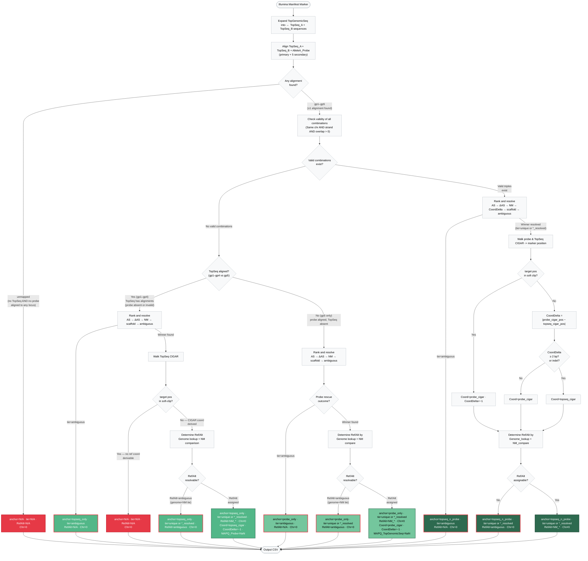

## Remapping Decision Tree

The diagram below shows the full per-marker decision flow in `scripts/remap_manifest.py`.

```mermaid
flowchart TD
    %% Node colours encode coordinate role (background) and Chr=0 (red stroke)
    classDef topseq_n_probe      fill:#2d6a4f,color:#fff,stroke:#1b4332,stroke-width:2px
    classDef topseq_only         fill:#52b788,color:#fff,stroke:#2d6a4f,stroke-width:2px
    classDef probe_only          fill:#74c69d,color:#000,stroke:#2d6a4f,stroke-width:2px
    classDef unmapped            fill:#e63946,color:#fff,stroke:#c1121f,stroke-width:2px
    classDef chr0_tnp            fill:#2d6a4f,color:#fff,stroke:#e63946,stroke-width:3px
    classDef chr0_to             fill:#52b788,color:#fff,stroke:#e63946,stroke-width:3px
    classDef chr0_po             fill:#74c69d,color:#000,stroke:#e63946,stroke-width:3px
    classDef process             fill:#f8f9fa,color:#000,stroke:#adb5bd,stroke-width:1px

    %% ── Input ──────────────────────────────────────────────────────────────
    INPUT([Illumina Manifest Marker]):::process

    INPUT --> PARSE["Expand TopGenomicSeq into →  TopSeq_A + TopSeq_B sequences"]:::process

    %% ── Alignment ──────────────────────────────────────────────────────────
    PARSE --> ALIGN["Align TopSeq_A + TopSeq_B + AlleleA_Probe<br/>(primary + 5 secondary)"]:::process

    %% ── Early unmapped exit (nothing aligned at all) ───────────────────────
    ALIGN --> TS_CHECK{"Any alignment<br/>found?"}:::process

    TS_CHECK -->|"unmapped<br/>(no TopSeq AND no probe<br/>aligned to any locus)"| UNM_TS["anchor=N/A · tie=N/A · RefAlt=N/A<br/>Chr=0"]:::unmapped

    %% ── Valid-triple construction (gp1–gp5 all proceed here) ───────────────
    TS_CHECK -->|"gp1–gp5<br/>(≥1 alignment found)"| SBP_BUILD["Check validity of all combinations<br/>(Same chr AND strand AND overlap > 0)"]:::process

    SBP_BUILD --> VALID{"Valid combinations<br/>exist?"}:::process

    %% ── No-valid-triple split: TopSeq present (gp1–gp4) vs absent (gp5) ──────
    VALID -->|"No valid combinations"| TS_PRESENT{"TopSeq aligned?<br/>(gp1–gp4 vs gp5)"}:::process

    %% ── No-valid-triple rescue: TopSeq (gp1–gp4) ───────────────────────────
    TS_PRESENT -->|"Yes (gp1–gp4)<br/>TopSeq has alignments<br/>(probe absent or invalid)"| RESCUE["Rank and resolve<br/>AS → ΔAS → NM → scaffold → ambiguous"]:::process

    RESCUE -->|"tie=ambiguous"| AMB_TS["anchor=topseq_only · tie=ambiguous<br/>RefAlt=N/A · Chr=0"]:::chr0_to

    RESCUE -->|"Winner found"| CIGAR_SC["Walk TopSeq CIGAR"]:::process

    CIGAR_SC --> SC_CHECK{"target pos<br/>in soft-clip?"}:::process

    SC_CHECK -->|"Yes — no ref coord<br/>derivable"| UNM_SC["anchor=N/A · tie=N/A · RefAlt=N/A<br/>Chr=0"]:::unmapped

    SC_CHECK -->|"No — CIGAR coord<br/>derived"| RA_RESCUE["Determine Ref/Alt<br/>Genome lookup + NM comparison"]:::process

    RA_RESCUE --> RA_RESCUE_CHECK{"Ref/Alt<br/>resolvable?"}:::process

    RA_RESCUE_CHECK -->|"RefAlt=ambiguous<br/>(genome+NM tie)"| AMB_RA["anchor=topseq_only · tie=unique or *_resolved · RefAlt=ambiguous · Chr=0"]:::chr0_to

    RA_RESCUE_CHECK -->|"Ref/Alt<br/>assigned"| TSONLY["anchor=topseq_only · tie=unique or *_resolved · RefAlt=NM_* · Chr≠0<br/>Coord=topseq_cigar · CoordDelta=−1 · MAPQ_Probe=NaN"]:::topseq_only

    %% ── No-valid-triple rescue: Probe (gp5 only) ───────────────────────────
    TS_PRESENT -->|"No (gp5 only)<br/>probe aligned, TopSeq absent"| PROBE_RESCUE["Rank and resolve<br/>AS → ΔAS → NM → scaffold → ambiguous"]:::process

    PROBE_RESCUE --> PROBE_OUT{"Probe rescue<br/>outcome?"}:::process

    PROBE_OUT -->|"tie=ambiguous"| AMB_PROBE["anchor=probe_only · tie=ambiguous · RefAlt=N/A · Chr=0"]:::chr0_po

    PROBE_OUT -->|"Winner found"| RA_PROBE["Determine Ref/Alt by<br/>Genome lookup + NM compare"]:::process

    RA_PROBE --> RA_PROBE_CHECK{"Ref/Alt<br/>resolvable?"}:::process

    RA_PROBE_CHECK -->|"RefAlt=ambiguous<br/>(genome+NM tie)"| AMB_PROBE_RA["anchor=probe_only · tie=unique or *_resolved<br/>RefAlt=ambiguous · Chr=0"]:::chr0_po

    RA_PROBE_CHECK -->|"Ref/Alt<br/>assigned"| PROBEONLY["anchor=probe_only · tie=unique or *_resolved<br/>RefAlt=NM_* · Chr≠0<br/>Coord=probe_cigar · CoordDelta=−1 · MAPQ_TopGenomicSeq=NaN"]:::probe_only

    %% ── Valid-triple resolution ──────────────────────────────────────────────
    VALID -->|"Valid triples<br/>exist"| RANK["Rank and resolve<br/>AS → ΔAS → NM → CoordDelta → scaffold → ambiguous"]:::process

    RANK -->|"tie=ambiguous"| AMB1["anchor=topseq_n_probe · tie=ambiguous<br/>RefAlt=N/A · Chr=0"]:::chr0_tnp

    %% ── CIGAR cross-validation and coordinate selection (before Ref/Alt) ────
    RANK -->|"Winner resolved<br/>(tie=unique or *_resolved)"| PROBE_COORD["Walk probe & TopSeq CIGAR -> marker position"]:::process

    PROBE_COORD --> DELTA_CHECK{"target pos<br/>in soft clip?"}:::process

    DELTA_CHECK -->|"Yes"| USE_PROBE["Coord=probe_cigar · CoordDelta=−1"]:::process

    DELTA_CHECK -->|"No"| DELTA_CALC["CoordDelta =<br/>|probe_cigar_pos − topseq_cigar_pos|"]:::process

    DELTA_CALC --> DELTA_THRESH{"CoordDelta<br/>≥ 2 bp?<br/>or indel?"}:::process

    DELTA_THRESH -->|"No"| USE_PROBE2["Coord=probe_cigar"]:::process

    DELTA_THRESH -->|"Yes"| USE_CIGAR["Coord=topseq_cigar"]:::process

    USE_PROBE  --> DRA
    USE_PROBE2 --> DRA
    USE_CIGAR  --> DRA

    DRA["Determine Ref/Alt by<br/>Genome_lookup + NM_compare"]:::process

    DRA --> NM_WIN{"Ref/Alt<br/>assignable?"}:::process

    NM_WIN -->|"No"| AMB2["anchor=topseq_n_probe · tie=unique or *_resolved<br/>RefAlt=ambiguous · Chr=0"]:::chr0_tnp

    NM_WIN -->|"Yes"| PLACED["anchor=topseq_n_probe · tie=unique or *_resolved<br/>RefAlt=NM_* · Chr≠0"]:::topseq_n_probe

    PLACED       --> OUTPUT_END([Output CSV]):::process
    TSONLY       --> OUTPUT_END
    PROBEONLY    --> OUTPUT_END
    UNM_TS       --> OUTPUT_END
    AMB_TS       --> OUTPUT_END
    UNM_SC       --> OUTPUT_END
    AMB_RA       --> OUTPUT_END
    AMB_PROBE    --> OUTPUT_END
    AMB_PROBE_RA --> OUTPUT_END
    AMB1         --> OUTPUT_END
    AMB2         --> OUTPUT_END
```

---

