# Array Manifest Remapper — Pipeline Decision Tree

> **Living document.** Reflects the fully implemented state of the pipeline as of 2026-04-06.
> All items in this document are implemented and operational unless explicitly marked otherwise.
> Empirical accuracy figures are from the EquCab3-native v2 manifest benchmark.

---

## 1 · Full Pipeline Decision Tree

```mermaid
flowchart TD
    classDef tier1    fill:#2d6a4f,color:#fff,stroke:#1b4332,stroke-width:2px
    classDef tier2    fill:#52b788,color:#fff,stroke:#2d6a4f,stroke-width:2px
    classDef tier5    fill:#e63946,color:#fff,stroke:#c1121f,stroke-width:2px
    classDef process  fill:#f8f9fa,color:#000,stroke:#adb5bd,stroke-width:1px

    %% ── Input ──────────────────────────────────────────────────────────────
    INPUT([Illumina Manifest Marker]):::process

    INPUT --> PARSE["extract_candidates\nParse TopGenomicSeq → PREFIX · [A/B] · SUFFIX\nCompute PreLen · PostLen\nDetect assay type I / II\nExpand into TopSeq_A · TopSeq_B sequences"]:::process

    %% ── Alignment ──────────────────────────────────────────────────────────
    PARSE --> ALIGN["minimap2  -ax sr  -N 5\nTopSeq_A + TopSeq_B  (primary + up to 5 secondary)\nAlleleA_ProbeSeq       (primary + up to 5 secondary)\nAll alignments retained — no strand constraint"]:::process

    %% ── TopSeq alignment check ─────────────────────────────────────────────
    ALIGN --> TS_CHECK{"TopGenomicSeq\naligned?"}:::process

    TS_CHECK -->|"Neither A nor B\naligned to any locus"| UNM_TS["unmapped\nChr=0 · Strand=N/A\nno alignment available"]:::tier5

    %% ── Valid-triple construction ───────────────────────────────────────────
    TS_CHECK -->|"≥1 allele aligned"| SBP_BUILD["build_valid_triples + rank_and_resolve\nEnumerate all (TopSeq_allele × TopSeq_align × probe_align) triples\nValidity: TopSeq chr = Probe chr  AND  strand_agreement ∈ {True, N/A}  AND  overlap > 0\nRank: AS_sum → ΔAS_sum → NM_sum → CoordDelta → scaffold → ambiguous\nMAPQ reported as diagnostic only (not used for ranking)"]:::process

    SBP_BUILD --> VALID{"Valid triples\nexist?"}:::process

    %% ── No-valid-triple rescue ──────────────────────────────────────────────
    VALID -->|"No valid triples\nTopSeq aligned but probe\nabsent · wrong chr · no overlap"| RESCUE["best_topseq_rescue\nPick highest-AS/MAPQ TopSeq alignment\nacross both alleles (anchor=topseq_only)"]:::process

    RESCUE --> RESCUE_CHECK{"TopSeq mapped\nto placed chr?"}:::process

    RESCUE_CHECK -->|"No mapped\nTopSeq alignment"| UNM_NO["unmapped\nChr=0"]:::tier5

    RESCUE_CHECK -->|"Mapped TopSeq\nalignment found"| CIGAR_SC["parse_cigar_to_ref_pos\nWalk CIGAR from TopSeq alignment\nQuery index = PreLen (+ strand)\nor PostLen (− strand)"]:::process

    CIGAR_SC --> SC_CHECK{"SNP target\nin soft-clipped\nregion?"}:::process

    SC_CHECK -->|"Yes — target index\nfalls in soft clip\nno ref coord derivable"| UNM_SC["unmapped\nChr=0\n(42 markers in v2→EquCab3)"]:::tier5

    SC_CHECK -->|"No — CIGAR coord\nsuccessfully derived"| RA_RESCUE["determine_ref_alt\nNM comparison at rescued chr\nthen resolve_ref_from_genome if tie"]:::process

    RA_RESCUE --> RA_RESCUE_CHECK{"Ref/Alt\nresolvable?"}:::process

    RA_RESCUE_CHECK -->|"NM tie\nunresolvable\n(16 markers)"| UNM_RA["unmapped\nChr=0"]:::tier5

    RA_RESCUE_CHECK -->|"Ref/Alt\nassigned"| TSONLY["topseq_only\nCoord = CIGAR coord\nCoordSource = cigar\nCoordDelta = −1\nMAPQ_Probe = NaN\nanchor = topseq_only\n1,336 markers rescued\n72.9% correct vs ground truth"]:::tier2

    %% ── Valid-triple resolution ──────────────────────────────────────────────
    VALID -->|"1 unique chr:pos"| DRA:::process

    VALID -->|"Placed chr + scaffolds\n1 unique placed locus"| SCAF["scaffold_resolved\n→ competing rows → scaffold_resolved_markers.csv"]:::tier1

    VALID -->|"2+ placed loci tied on MAPQ+AS\nNM breaks position tie"| NMPOS["nm_position_resolved\n→ competing rows → nm_position_resolved_markers.csv"]:::tier1

    VALID -->|"2+ placed loci\nNM also tied"| AMB1["ambiguous\nChr=0\ncompeting rows → ambiguous_markers.csv"]:::tier5

    SCAF --> DRA
    NMPOS --> DRA

    DRA["determine_ref_alt\nCompare NM of allele A vs B\nat winning chromosome\nLower NM = reference allele"]:::process

    DRA --> NM_WIN{"NM clear\nwinner?"}:::process

    NM_WIN -->|"Yes"| PROBE_COORD["get_probe_coordinate\nProbe CIGAR walk · Probe strand · Assay type\nc_pos = 1-based variant position\n(3′ end for Infinium II · last base for Infinium I)\n(minus-strand deletion correction applied)"]:::process

    NM_WIN -->|"NM tie"| PYSAM["resolve_ref_from_genome\npysam fetch reference base at c_pos\ncompare to AlleleA · AlleleB (strand-normalised)"]:::process

    PYSAM -->|"Ref matches\none allele"| REFRES["ref_resolved\n(105 markers in v2→EquCab3)"]:::tier1
    PYSAM -->|"Triallelic\nref ≠ either allele"| AMB2["ambiguous\nChr=0\n(146 markers)"]:::tier5

    REFRES --> PROBE_COORD

    %% ── CIGAR cross-validation and coordinate selection ─────────────────────
    PROBE_COORD --> CIGAR_XV["parse_cigar_to_ref_pos\nIndependent CIGAR walk on TopSeq alignment\nQuery index = PreLen (+ strand) or PostLen (− strand)\nProduces cigar_coord in parallel with c_pos"]:::process

    CIGAR_XV --> DELTA_CHECK{"CIGAR target\nin soft clip?"}:::process

    DELTA_CHECK -->|"Yes\n(SNP in soft-clipped\nregion of TopSeq)"| USE_PROBE["CoordSource = probe\nCoordDelta = −1\nfinal_pos = c_pos\n(CIGAR unavailable for this marker)"]:::process

    DELTA_CHECK -->|"No\ncigar_coord derived"| DELTA_CALC["CoordDelta = |c_pos − cigar_coord|\nCoordProbe = c_pos  (raw, always stored)\nCoord_TopSeqCIGAR = cigar_coord  (always stored)"]:::process

    DELTA_CALC --> DELTA_THRESH{"CoordDelta\n≥ 2 bp?"}:::process

    DELTA_THRESH -->|"No  (delta = 0 or 1)\nProbe is more reliable\nor both agree"| USE_PROBE2["CoordSource = probe\nfinal_pos = c_pos\n81,433 markers (99.0%)"]:::process

    DELTA_THRESH -->|"Yes  (delta ≥ 2 bp)\nCIGAR empirically more accurate"| USE_CIGAR["CoordSource = cigar\nfinal_pos = cigar_coord\n660 markers (0.8%)\n~85% correct vs 4% with probe"]:::process

    USE_PROBE  --> FINAL_COL
    USE_PROBE2 --> FINAL_COL
    USE_CIGAR  --> FINAL_COL

    FINAL_COL["MapInfo_{assembly} = final_pos\nRefBaseMatch = genome base vs strand-normalised Ref\nAll diagnostic columns stored in output CSV"]:::process

    FINAL_COL --> PLACED["mapped / scaffold_resolved\nnm_position_resolved / ref_resolved\nTier 1 — Probe-validated"]:::tier1

    TSONLY --> OUTPUT_TSONLY["topseq_only — Tier 2\nNo probe validation"]:::tier2

    PLACED  --> OUTPUT_END([Output CSV]):::process
    OUTPUT_TSONLY --> OUTPUT_END
```



---

## 2 · Component Definitions

### 2.1 Input fields consumed from manifest

| Field | Used for |
|---|---|
| `TopGenomicSeq` | Genomic context `PREFIX[A/B]SUFFIX`; parsed into two alignment candidates (TopSeq_A, TopSeq_B) |
| `AlleleA_ProbeSeq` | 50 bp probe; aligned independently; absent (NaN) for Infinium II markers |
| `AlleleB_ProbeSeq` | Present only for Infinium I; NaN for Infinium II |
| `IlmnStrand` | TOP/BOT; used in XOR allele-usage decision |
| `SourceStrand` | TOP/BOT/PLUS/MINUS; used in XOR allele-usage decision AND as ground-truth strand in benchmark |
| `RefStrand` | NOT used by the pipeline; encodes probe design convention, not alignment strand |

### 2.2 Key functions

| Function | Role | Inputs | Output |
|---|---|---|---|
| `extract_candidates` | Parse `TopGenomicSeq` | manifest row | `AlleleA`, `AlleleB`, `PreLen`, `PostLen` |
| `parse_topseq_sam` | Parse minimap2 TopSeq SAM; both primary and secondary | SAM file | `{name: {A: [aligns], B: [aligns]}}` each with Chr, Pos, Strand, Cigar, MAPQ, NM, AS |
| `parse_probe_sam` | Parse minimap2 probe SAM; includes NM tag | SAM file | `{name: [aligns]}` each with Chr, Pos, Strand, Cigar, MAPQ, NM, AS |
| `compute_alignment_status` | Census of which alignment sources had hits | `ts_aligns`, `pb_aligns` | `"gp1"–"gp5"` or `"unmapped"` |
| `build_valid_triples` | Enumerate all valid (TopSeq_allele × ts_align × pb_align) triples; applies strand hard filter | `ts_aligns`, `pb_aligns` | list of `(allele, ts, pb)` triples |
| `rank_and_resolve` | Rank triples by AS_sum → ΔAS_sum → NM_sum → CoordDelta → scaffold → ambiguous; resolve locus | valid triples | `(winner, allele, ts, pb, tie_label)` or `(ambiguous, competing)` or `None` |
| `_rank_single_aligns` | Sort individual alignments by AS → MAPQ | list of aligns | sorted list |
| `best_topseq_rescue` | Pick best TopSeq alignment when no valid triple; produces `anchor=topseq_only` | `ts_aligns` | `(allele, alignment_dict)` or `(None, None)` |
| `best_probe_rescue` | Pick best probe alignment when no TopSeq; produces `anchor=probe_only` | `pb_aligns` | `alignment_dict` or `None` |
| `determine_ref_alt` | Internal: NM-based allele assignment; pure TopSeq | winning alignment, all aligns, `candidates_info` | `(ref_char, alt_char)` or `None` if NM tied |
| `determine_ref_alt_v2` | Primary Ref/Alt method: genome lookup + NM in parallel; reports agreement | pysam FASTA, chr, pos, strand, ts_aligns, candidates_info | `(ref_char, alt_char, agreement_label)` |
| `resolve_ref_from_genome` | Strand-aware genome reference base lookup | pysam FASTA, chr, pos, strand, alleles | `(ref_char, alt_char)` or `None` if triallelic/no match |
| `get_probe_coordinate` | SNP position from probe alignment | probe pos, CIGAR, strand, assay type | 1-based variant position `c_pos` |
| `parse_cigar_to_ref_pos` | SNP position from TopSeq CIGAR walk | TopSeq pos, CIGAR, query index | `(ref_pos, in_softclip)` |
| `compute_qcov` | Fraction of query in M/=/X ops | CIGAR string | `float` 0–1; H excluded (not in SEQ field) |
| `compute_soft_clip_frac` | Fraction of query that is soft-clipped | CIGAR string | `float` 0–1 |

### 2.3 Key quantities

| Symbol | Meaning |
|---|---|
| `PreLen` | Length of PREFIX in `TopGenomicSeq`; 0-based query index of the SNP bracket on the + strand |
| `PostLen` | Length of SUFFIX; 0-based query index of the SNP bracket when the query is reverse-complemented (used for − strand alignments) |
| `NM` | minimap2 `NM:i:<n>` edit-distance tag: mismatches + gap opens between aligned sequence and reference; NOT derived from CIGAR walking (CIGAR is used only for coordinate computation) |
| `NM_sum` | `NM_ts + NM_pb` for a triple; tertiary ranking criterion in `rank_and_resolve` |
| `MAPQ` | minimap2 mapping quality; proxy for alignment uniqueness (0 = multi-mapper); reported as diagnostic only in v2 algorithm (no longer used for ranking) |
| `AS` | minimap2 alignment score; primary ranking criterion in `rank_and_resolve` via `AS_sum = ts.AS + pb.AS` |
| `AS_sum` | `AS_ts + AS_pb` for a triple; primary ranking criterion in `rank_and_resolve` |
| `ΔAS_sum` | `ΔAS_ts + ΔAS_pb`: gap between best and 2nd-best AS across triples at the winning locus; secondary ranking criterion |
| `DeltaScore` | `AS_best − AS_2nd` across all TopSeq alignments; −1 if only one alignment (uniquely placed by definition); reported as `DeltaScore_TopGenomicSeq` in output |
| `CoordDelta` | `|c_pos − cigar_coord|`; −1 if CIGAR coord unavailable (SNP in soft-clipped region or topseq_only marker) |

---

## 3 · Output Columns

All column names that embed the assembly name use the string passed via `-a` (e.g. `-a equCab3` → `Chr_equCab3`).

### 3.1 Coordinate and position columns

| Column | Type | Meaning |
|---|---|---|
| `Chr_{assembly}` | str | Chromosome (`"0"` = unmapped or ambiguous) |
| `MapInfo_{assembly}` | int | **Final chosen 1-based position** — probe-derived if `CoordDelta < 2`, CIGAR-derived if `CoordDelta ≥ 2` |
| `CoordProbe_{assembly}` | int | Raw probe-derived coordinate before any CIGAR override; `0` for `topseq_only` and unmapped |
| `Coord_TopSeqCIGAR_{assembly}` | int | CIGAR-walk coordinate from TopGenomicSeq alignment; `0` if SNP target in soft clip |
| `CoordDelta_{assembly}` | int | `\|CoordProbe − Coord_TopSeqCIGAR\|`; `−1` if CIGAR coord unavailable |
| `CoordSource_{assembly}` | str | `"probe"`, `"cigar"`, or `"N/A"` — which coord is in `MapInfo` |
| `Strand_{assembly}` | str | `+`, `−`, or `N/A` — TopGenomicSeq alignment strand |
| `Ref_{assembly}` | str | Reference allele in TopGenomicSeq alignment strand (not + strand) |
| `Alt_{assembly}` | str | Alternate allele in alignment strand |
| `RefBaseMatch_{assembly}` | str | `"True"` / `"False"` / `"N/A"` — does genome reference base at `MapInfo` match `Ref` after strand normalisation? |

### 3.2 Alignment quality columns

| Column | Type | Meaning |
|---|---|---|
| `MAPQ_TopGenomicSeq` | int | MAPQ of winning TopSeq alignment |
| `MAPQ_Probe` | int | MAPQ of winning probe alignment; `0` for `topseq_only` markers |
| `DeltaScore_TopGenomicSeq` | int | AS gap between 1st and 2nd-best TopSeq alignments; `−1` if fewer than 2 alignments |
| `QueryCov_TopGenomicSeq` | float | Fraction of TopSeq query in M/=/X aligned ops (excludes soft/hard clips); `0.0` for unmapped |
| `SoftClipFrac_TopGenomicSeq` | float | Fraction of TopSeq query that is soft-clipped; `0.0` for unmapped |

### 3.3 Decision columns

| Column | Values |
|---|---|
| `AlignmentStatus_{assembly}` | `gp1` (both TopSeq alleles + probe), `gp2` (one TopSeq + probe), `gp3` (both TopSeq, no probe), `gp4` (one TopSeq, no probe), `gp5` (probe only), `unmapped` |
| `anchor_{assembly}` | `topseq_n_probe`, `topseq_only`, `probe_only`, `N/A` |
| `tie_{assembly}` | `unique`, `AS_resolved`, `dAS_resolved`, `NM_resolved`, `CoordDelta_resolved`, `scaffold_resolved`, `ambiguous`, `N/A` |
| `RefAltMethodAgreement_{assembly}` | `NM_match`, `NM_unmatch`, `NM_tied`, `NM_N/A`, `NM_only`, `ambiguous` (see §4 for definitions) |

---

## 4 · Decision Column Value Definitions

### `anchor_{assembly}` values

| Value | Meaning | Tier |
|---|---|---|
| `topseq_n_probe` | Coordinate derived from a valid (TopSeq × probe) triple | **1** |
| `topseq_only` | No valid triple; TopSeq CIGAR walk used for coordinate (`CoordSource=cigar`, `MAPQ_Probe=NaN`) | **2** |
| `probe_only` | No TopSeq alignment; probe CIGAR walk used for coordinate | **2** |
| `N/A` | Unmapped or ambiguous; Chr=0 | **5** |

### `tie_{assembly}` values

| Value | Meaning |
|---|---|
| `unique` | Only one locus candidate — no tie to break |
| `AS_resolved` | Multiple candidates; highest AS_sum was unique |
| `dAS_resolved` | AS_sum tied; highest ΔAS_sum broke the tie |
| `NM_resolved` | AS_sum and ΔAS_sum tied; lowest NM_sum broke the tie |
| `CoordDelta_resolved` | NM_sum also tied; lowest CoordDelta broke the tie |
| `scaffold_resolved` | One candidate on placed chr, rest on scaffolds; placed chr accepted |
| `ambiguous` | Tied candidates remain after all ranking steps; Chr=0 |
| `N/A` | No valid triples (topseq_only, probe_only, or unmapped) |

### `RefAltMethodAgreement_{assembly}` values (SNPs)

| Value | Meaning |
|---|---|
| `NM_match` | Genome lookup and NM comparison both succeeded and agree |
| `NM_unmatch` | Both succeeded but disagree — genome result used (flag for QC; inspect for nearby variants) |
| `NM_tied` | Genome succeeded; NM was tied — genome result used |
| `NM_N/A` | Genome succeeded; NM not applicable (probe_only marker) |
| `NM_only` | Genome lookup failed; NM result used |
| `ambiguous` | Both methods failed — Chr=0 |

For **indels**: `NM_match` = deletion Ref confirmed by genome fetch; `NM_unmatch` = deletion Ref mismatch (marker removed by design-conflict filter in qc_filter.py); insertion refs always pass (`NM_match`).

**What is NM?** `NM` is the `NM:i:<n>` edit-distance tag written by minimap2 into each SAM alignment record. It counts mismatches and gap opens between the aligned sequence and the reference — it is **not** derived from CIGAR walking. CIGAR walking is used only for coordinate computation (`parse_cigar_to_ref_pos`, `get_probe_coordinate`).

### Rescue breakdown (no-valid-triple markers)

| Outcome | anchor | Count | Reason |
|---|---|---|---|
| Rescued via TopSeq CIGAR | `topseq_only` | 1,336 | CIGAR coord derived and Ref/Alt resolved |
| Rescued via probe | `probe_only` | — | probe aligned but no TopSeq; coord from probe CIGAR |
| Failed — SNP in soft-clipped region | `N/A` | 42 | TopSeq aligned but SNP target index in soft clip |
| Failed — both methods unresolvable | `N/A` | 16 | CIGAR coord available but Ref/Alt ambiguous |

---

## 5 · Coordinate Selection Rule

For all probe-validated markers (`anchor=topseq_n_probe`), two independent coordinates are computed and compared:

| CoordDelta | Final coordinate used | Empirical accuracy (correct vs ground truth) |
|---|---|---|
| `0` | Probe (`CoordSource=probe`) | 99.0% correct |
| `1` | Probe (`CoordSource=probe`) | 45.9% coord-accurate (probe wins over CIGAR at this delta) |
| `≥ 2` | CIGAR (`CoordSource=cigar`) | ~64–86% correct (CIGAR wins strongly; probe only 4–17%) |
| `−1` (soft-clip) | Probe (`CoordSource=probe`) | CIGAR unavailable; probe coord used as-is |

**Rule:** `MapInfo = cigar_coord if CoordDelta ≥ 2 else c_pos`

`CoordProbe` always stores the raw `c_pos` before the override, enabling retrospective comparison.

**Empirical basis:** Stratified benchmark against EquCab3-native v2 manifest ground truth. See `scripts/benchmark_cigar_vs_probe.py`.

---

## 6 · Confidence Tier Summary

| Tier | Label | `anchor` value | Coordinate evidence | Empirical accuracy |
|---|---|---|---|---|
| **1** | Probe-validated | `topseq_n_probe` | Probe + TopSeq overlap confirmed; CIGAR cross-check applied | 98.7% overall; 99.9% coord-accurate at CoordDelta=0 |
| **2** | Rescue (CIGAR-only) | `topseq_only` | TopSeq CIGAR walk; no probe validation | 72.9% correct vs ground truth |
| **2** | Rescue (probe-only) | `probe_only` | Probe CIGAR walk; no TopSeq alignment | — |
| **5** | Unresolved | `N/A` | Chr=0; no reliable genome position assigned | — |

> Note: `CoordDelta` serves as a continuous within-Tier-1 quality signal; the coordinate selection rule (`CoordDelta ≥ 2 → use CIGAR`) is applied automatically during remapping.

---

## 7 · QC Filter Cascade (qc_filter.py)

Filters are applied sequentially. Each stage removes markers from the previous count.

| Stage | Filter condition | Removed (v2→EquCab3, default settings) | Flag |
|---|---|---|---|
| 1. Unmapped | `Strand_{assembly} == N/A` | 396 | always on |
| 2. MAPQ | `MAPQ_TopGenomicSeq < 30` | 1,517 | `--mapq-topseq 30` |
| 2.5. CoordDelta | `CoordDelta > threshold` OR `anchor_{assembly} == "topseq_only"` | disabled by default | `--coord-delta N` (N ≥ 0) |
| 3. Design conflict | Strand-normalised `Ref` ≠ genome reference base at `MapInfo` | 228 | always on |
| 4. Polymorphic | Multiple Ref/Alt assignments at same Chr:Pos | 31 | always on |
| 5. Consistency | SAM record count at Chr ≠ 3 (topseq_A + topseq_B + probe) | 656 | requires SAM files |

**Final output (default settings):** 81,491 markers

**With `--coord-delta 0`:** 81,347 markers (−144 vs default; removes 186 CoordDelta>0 + 741 topseq_only − downstream filter reductions)

**Note on `--coord-delta` and `topseq_only`:** `topseq_only` markers carry `CoordDelta=−1` (no probe coord to compare), so they would numerically pass any threshold ≥ 0. They are explicitly removed whenever `--coord-delta` is active (via `anchor_{assembly} == "topseq_only"` check) because they lack probe validation entirely.

---

## 8 · Marker Flow Summary (v2 manifest → EquCab3)

```
Input:                          84,319

TopGenomicSeq alignment:
  Both A and B aligned:         84,125
  Only one allele aligned:           2
  Neither aligned → unmapped:      192   (truly unrecoverable)

Triple construction:
  ≥1 valid triple found:        82,733
  No valid triple (total):       1,394
    ├ rescued → topseq_only:     1,336
    ├ failed (SNP in soft clip):    42
    └ failed (NM tie):              16

Position resolution (of 82,733 with valid triples):
  Unique winner (tie=unique):   82,733
  scaffold_resolved:                 0
  nm_position_resolved:              0
  True tie → ambiguous:              0

Ref/Alt assignment:
  Genome lookup succeeded:      82,587   (NM_match or NM_tied or NM_unmatch)
  NM tie → triallelic → ambiguous: 146

Final output (remap_manifest.py, by anchor):
  topseq_n_probe:               82,587   (Tier 1)
  topseq_only:                   1,336   (Tier 2)
  probe_only:                        —   (Tier 2; count depends on assembly)
  ambiguous (Chr=0, anchor=N/A):   146
  unmapped (Chr=0, anchor=N/A):    250

After QC cascade (default --mapq-topseq 30):
  Final markers:                81,491
```

---

## 9 · Benchmark Accuracy (v2 → EquCab3, against EquCab3-native ground truth)

Benchmark script: `scripts/benchmark_compare.py`
Three-way comparison script: `scripts/benchmark_cigar_vs_probe.py`

**Headline (82,222 benchmarked markers; Chr=Y and Chr=0 excluded):**

| Coord source | Correct | Coord-accurate | Coord-off | Unmapped |
|---|---|---|---|---|
| Probe only (`CoordProbe`) | 98.0% | 99.0% | 0.2% | 0.8% |
| CIGAR only (`Coord_TopSeqCIGAR`) | 98.6% | 99.6% | 0.1% | 0.2% |
| **Final (`MapInfo`, best-of-both)** | **98.7%** | **99.7%** | **0.1%** | **0.2%** |

**Accuracy stratified by CoordDelta:**

| CoordDelta | N | Probe correct | CIGAR correct | Final correct |
|---|---|---|---|---|
| 0 | 81,348 | 99.0% | 99.0% | 99.0% |
| 1 | 85 | 45.9% | 29.4% | 45.9% (probe kept) |
| 2–10 | 67 | ~20% | ~70% | ~70% (CIGAR used) |
| > 10 | 28 | 3.6% | 85.7% | 85.7% (CIGAR used) |
| −1 (topseq_only + soft-clip) | 694 | 0% | 72.9% | 72.9% |

> `CoordDelta = 0` markers are identical between probe and CIGAR — the 99.0% ceiling reflects true alignment/biology limits, not a method deficiency.
